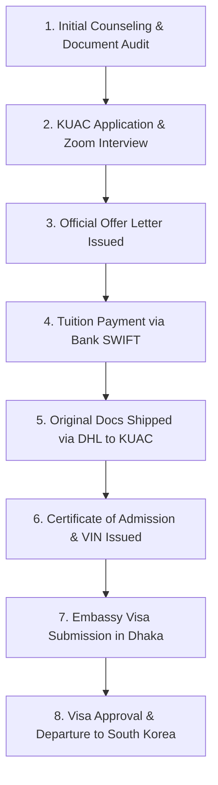

# KEYSTONE EDUCATION CONSULTANCY
### *"Where Global Dreams Begin"*

---

# 🇰🇷 Kyungdong University (KDU Global) — Academic Intakes & Admission Requirements Guide
**Document Version:** 1.0 | **Date:** 30 July 2026 | **Author:** Keystone Education Consultancy  
**Target Audience:** Prospective Students, Parents & Branch Counselors

---

## 📌 Executive Summary & December Semester Availability

Kyungdong University (KDU Global) is one of the premier higher education institutions in South Korea for international students, offering dual English and Korean instruction pathways. Below is the definitive status regarding **December Intake Availability** across all three major programs:

| Program Type | December Intake Status | Academic Term Details & Timelines |
| :--- | :--- | :--- |
| **EAP (English for Academic Purposes)** | 🟢 **OPEN (Winter Term)** | Language & academic preparation term starts in **December**. Application deadline: October–November. |
| **KLP (Korean Language Program)** | 🟢 **OPEN (Winter Term)** | 10-week intensive Korean language session starts in **December**. Application deadline: October–November. |
| **Bachelor's Degree Programs** | 🟡 **Application Window Only** | Degree classes do **NOT** start in December (Degree intakes are **March [Spring]** & **September [Fall]**). However, **December is the primary application deadline window** for the upcoming Spring (March) intake. |

> [!IMPORTANT]
> **Key Guidance for Counselors:**  
> If a student wishes to start studying in December, enrol them in the **EAP or KLP Winter Session**. Students completing the December EAP term transition directly into their chosen Bachelor's Degree program in the Spring (March) semester!

---

## 🎓 1. Program Options & Pathways

### A. EAP Pathway (English for Academic Purposes)
* **Target Audience:** Students aiming for English-medium Bachelor’s degrees who hold an IELTS 5.0 to 6.0 (or equivalent).
* **Structure:** Intensive academic English, writing, composition, and university foundation modules.
* **Intakes:** 4 times per year — **March, June, September, December**.
* **Progression:** Direct progression into KDU Global Bachelor's degree programs upon successful completion.

### B. Bachelor's Degree Direct Entry
* **Programs Available:** Business Administration, Hotel Management, Smart Computing, Artificial Intelligence, International Studies, and Design.
* **Instruction Medium:** 100% English-medium instruction.
* **Intakes:** 
  * **Spring Semester:** Classes begin **Early March** (Applications process: October – December).
  * **Fall Semester:** Classes begin **September** (Applications process: April – June).

### C. KLP (Korean Language Program)
* **Target Audience:** Students seeking Korean-medium undergraduate entry or cultural/language mastery.
* **Structure:** 10-week terms (200 hours per term) covering TOPIK levels 1 through 6.
* **Intakes:** **March, June, September, December**.

---

## 📋 2. Eligibility & Admission Requirements

To qualify for admission at Kyungdong University Global, international applicants must meet the following criteria:

### Academic Requirements
1. **Educational Qualification:** Completion of 12 years of formal education (HSC / A-Levels / High School Diploma or equivalent).
2. **Academic Performance:** Minimum GPA 3.0 out of 5.0 (or equivalent percentage grade).
3. **Study Gap:** Maximum **3 years** gap after the most recent formal graduation date.

### Language Proficiency Requirements
* **EAP Pathway Entry:** Minimum **IELTS 5.0** (or equivalent English test).
* **Bachelor's Direct Entry:** Minimum **IELTS 5.5 / 6.0**, TOEFL iBT 71, or equivalent.
* **Korean-Medium Bachelor Track:** Minimum **TOPIK Level 3** (or completion of KDU KLP Level 3/4).

### Financial Requirements
* **Bank Balance:** Minimum **USD $16,000** (or equivalent BDT) held in a 6-month savings or fixed deposit account.
* **Sponsorship:** Account must be under the name of the applicant or a parent (Father/Mother).
* **Validity:** Bank Statement and Certificate must be issued within **30 days** of document submission to KUAC.

---

## 📂 3. Comprehensive Document Checklist (KUAC / KDU Standard)

Every application submitted via the Korean Universities Admission Center (KUAC) must strictly comply with the following checklist:

| # | Document Name | Format / Processing Required | Special Instructions |
| :---: | :--- | :--- | :--- |
| 1 | **ID Photo** | 3.5cm x 4.5cm, White Background | 2 physical copies + high-res scan |
| 2 | **KDU Application Form** | [Form 1] Current 2026 Version | Must use the latest official template |
| 3 | **Academic Certificates & Transcripts** | **e-Apostille** via MoFA Dhaka | Original documents sent via DHL |
| 4 | **Passport Copy** | Scanned PDF (Color) | Minimum 18-month validity remaining |
| 5 | **Family Relationship Certificate (FRC)** | Original + English Translation | Issued by City Corporation / Union Parishad |
| 6 | **Birth Certificate** | Translated & Notarized | Applicant and Parents' details matching |
| 7 | **Bank Statement & Certificate** | Original (Bank Stamp + Signature) | Balance > USD 16,000; 6-month transaction history |
| 8 | **Nominated TB Test Certificate** | Original Medical Certificate | Issued by **PRAAVA HEALTH**, Banani, Dhaka |
| 9 | **Parents' No Objection Certificate (NOC)** | Notarized on ৳300 Stamp Paper | Signed by both parents |
| 10 | **EAP Pledge Statement** | [Form 6] Official Form | Mandatory for all EAP pathway applicants |
| 11 | **Police Clearance Certificate** | Issued by Bangladesh Police | Valid within 90 days (Required for Embassy stage) |
| 12 | **Affidavit of Same Name Declaration** | Notarized on Stamp Paper | *Mandatory if any spelling divergence exists across docs* |

---

## 🔄 4. Step-by-Step Application Process

1. **Step 1: Document Audit & Preparation**  
   Run internal audit using Keystone Audit Gate to ensure 0 spelling or formatting mismatches.
2. **Step 2: Zoom Interview with KDU Professor**  
   KUAC schedules a 10-minute online interview. Prepare the student on background and motivation.
3. **Step 3: Offer Letter & Tuition Payment**  
   Upon interview approval, KDU issues the Offer Letter. The student carries the **KDU-KUAC Confirmation Letter** to the bank to execute the SWIFT transfer.
4. **Step 4: Original Document Shipment**  
   Send apostilled originals and bank documents via DHL to KUAC head office in Bucheon-si, South Korea.
5. **Step 5: Visa Issuance Number (VIN)**  
   KUAC processes local immigration clearance in Korea and issues the VIN.
6. **Step 6: Embassy Visa Application**  
   Submit passport, VIN, police clearance, and Praava Health TB test report to the Embassy of South Korea in Dhaka.

---

## 🏢 Contact & Branch Support

**Keystone Education Consultancy**  
*Website:* [www.keystoneeducations.com](https://www.keystoneeducations.com)  
*Hotline:* +880 1941-646278  
*Email:* info@keystoneeducations.com  
*Official Asset Reference:* `assets/keystone_logo_official.png`

---
*Keystone Education Consultancy © 2026 | All Rights Reserved.*
