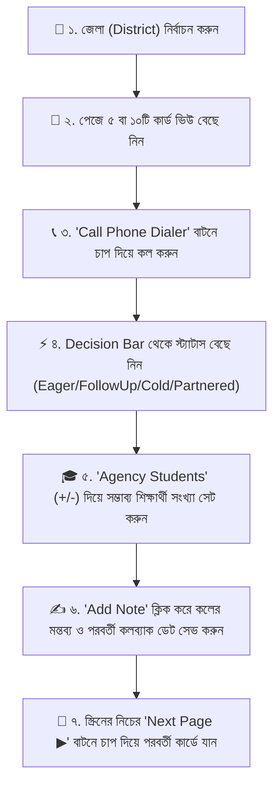

# 📘 Keystone B2B Outreach CRM — ব্যবহারকারী নির্দেশিকা (User Manual)

**লাইভ পোর্টাল লিংক:** 👉 **[https://keystone-2026.vercel.app/](https://keystone-2026.vercel.app/)**

---

> [!NOTE]  
> **উদ্দেশ্য:** এই পোর্টালটির মাধ্যমে কিউস্টোন (Keystone Education Consultancy) এর কর্মীরা বাংলাদেশের ৪৯টি জেলার **৮৫৯টি আইইএলটিএস (IELTS) ও ল্যাঙ্গুয়েজ কোচিং সেন্টারের** সাথে যোগাযোগের তথ্য পরিচালনা করতে পারবেন। কোনো লগইন বা পাসওয়ার্ডের ঝামেলা ছাড়াই মোবাইল ও কম্পিউটার উভয় মাধ্যমেই সহজে কল করা, রেসপন্স রেকর্ড করা এবং ফলোআপ ট্র্যাক করা যাবে।

---

## 📱 মোবাইল ভার্সনে মূল সুবিধাসমূহ (Key Highlights)

1. **জিরো-লগইন (Zero Friction Login):** কোনো পাসওয়ার্ড বা ইমেইল টাইপ করতে হবে না। লিংকটি ওপেন করলেই তাৎক্ষণিক ব্যবহার শুরু করা যাবে।
2. **এক ক্লিকে ডায়ালার (Native Phone Dialer):** `📞 Call Phone Dialer` বাটনে চাপ দিলে আপনার মোবাইলের আসল কলিং অ্যাপ (Phone Dialer) সরাসরি ওপেন হয়ে যাবে।
3. **১-ক্লিকে সিদ্ধান্ত গ্রহণ (Decision Bar):** প্রতিটি কার্ডেই আগ্রহী, ফলোআপ, কোল্ড বা পার্টনারড সিলেক্ট করার স্মার্ট বাটন রয়েছে।
4. **স্মার্ট বটম নেভিগেশন (Sticky Mobile Navigation Bar):** মোবাইল স্ক্রিনে নিচেই ভাসমান `◀ Prev Page` এবং `Next Page ▶` বাটন থাকবে, ফলে স্ক্রোল করে উপরে ওঠার প্রয়োজন নেই।

---

## 🚀 ধাপে ধাপে ব্যবহার নির্দেশিকা (Step-by-Step Operating Guide)

---

### 📍 ধাপ ১: জেলা নির্বাচন করা (Select District)
1. স্ক্রিনের উপরে থাকা **`📍 Select District`** ড্রপডাউন মেনু থেকে আপনার নির্ধারিত জেলাটি সিলেক্ট করুন (যেমন: *Dhaka (১৮৮টি সেন্টার)*, *Rajshahi (৭৭টি সেন্টার)*, *Cumilla (৮১টি সেন্টার)*, *Khulna (৫৮টি সেন্টার)* ইত্যাদি)।
2. অথবা ড্রপডাউনের ঠিক নিচে থাকা **Popular Districts** পিলস (যেমন: `Rajshahi`, `Dhaka`, `Bogura`, `Chittagong`, `Sylhet`) বাটনে ক্লিক করলেও সরাসরি সেই জেলার সেন্টারগুলো চলে আসবে।

---

### 🎴 ধাপ ২: পেজ প্রতি ৫ বা ১০টি কার্ড নির্বাচন করা
1. স্ক্রিনের উপরে **`🎴 Display Cards Per Row / Page`** সেকশনে ক্লিক করে **`5 Cards`** বা **`10 Cards`** বেছে নিতে পারেন।
2. ডিফল্টভাবে প্রতি পেজে ৫টি করে কার্ড দেখাবে যা মোবাইলে কাজ করার জন্য সবচেয়ে সুবিধাজনক।

---

### 📞 ধাপ ৩: সরাসরি ফোন কল করা (Call Dialer)
1. পছন্দের কোচিং সেন্টার কার্ডটিতে থাকা **`📞 Call Phone Dialer`** বাটনে চাপ দিন।
2. আপনার মোবাইলের ফোন ডায়ালার ওপেন হবে এবং নম্বরটি অটো-টাইপ হয়ে যাবে। সরাসরি কল অপশনে চাপ দিয়ে কথা বলুন।

---

### ⚡ ধাপ ৪: কোচিং সেন্টারের প্রতিক্রিয়া নির্বাচন করা (Select Status)
কথা বলা শেষে সেন্টারটির প্রতিক্রিয়া অনুযায়ী কার্ডের **Select Center Status** সেকশন থেকে নিচের যেকোনো ১টি বাটনে চাপ দিন:
* 🔥 **Eager**: কোচিং সেন্টার স্টুডেন্ট রেফার করতে খুব আগ্রহী হলে।
* 📞 **Follow Up**: পরবর্তীতে আবার কল করে বিস্তারিত জানতে চাইলে।
* ❄️ **Cold**: আপাতত স্টুডেন্ট পাঠাতে বা পার্টনারশিপে অনিচ্ছুক হলে।
* 🤝 **Partnered**: কিউস্টোনের সাথে অফিশিয়াল পার্টনারশিপ বা চুক্তি সম্পন্ন হলে।

---

### 🎓 ধাপ ৫: এজেন্সির স্টুডেন্ট সংখ্যা হিসাব রাখা (Agency Student Counter)
* প্রতিটি কার্ডেই **`🎓 Agency Students: [ - ] 0 [ + ]`** সেকশন রয়েছে।
* উক্ত কোচিং সেন্টারে বর্তমানে কিউস্টোনের সম্ভাব্য কতজন শিক্ষার্থী আছে তা `[ + ]` এবং `[ - ]` বাটনে ১-ট্যাপ করে সহজেই বাড়ানো বা কমানো যাবে।

---

### ✍️ ধাপ ৬: কল নোট ও প্রতিক্রিয়া সেভ করা (Add Call Log & Notes)
1. কার্ডের নিচে থাকা **`✍️ + Add Note`** বাটনে ক্লিক করুন।
2. একটি পপ-আপ মোডাল ওপেন হবে:
   * **✍️ Add Call Log / Agency Response:** কোচিং সেন্টারের ডিরেক্টর বা প্রতিনিধি কী বলেছেন (যেমন: *"মার্চ ২০২৭ ইনটেকের জন্য ৩ জন কোরিয়ার স্টুডেন্ট আছে, ফির বিস্তারিত পাঠাতে বলল"*), তা সংক্ষেপে লিখুন।
   * **Set Next Callback Date:** যদি আবার নির্দিষ্ট দিনে কল দিতে বলে, তবে পিকার থেকে তারিখ সিলেক্ট করুন।
3. **`💾 Save Call Log`** বাটনে চাপ দিন। 
4. নোটটি সেভ হওয়ার সাথে সাথে উক্ত সেন্টারের কার্ডের নিচে **📜 Notes & Agency Responses** ফিল্ডে প্রদর্শিত হবে।

> [!TIP]  
> **কল করা সমস্ত সেন্টার একসাথে দেখার উপায়:** স্ক্রিনের উপরের ফিল্টার বার থেকে **`📝 Logged Calls`** ট্যাবে ক্লিক করলে কেবল সেই সমস্ত সেন্টারগুলো দেখতে পাবেন যেগুলোতে আগে কল করে নোট বা প্রতিক্রিয়া সেভ করা হয়েছে।

---

### 📱 ধাপ ৭: নেভিগেশন (Next & Prev Page Navigation)
* আপনি যখন কার্ড ফিল্টার করবেন বা কল শেষ করবেন, মোবাইল স্ক্রিনের নিচের দিকে একটি হাই-কনট্রাস্ট ভাসমান **`◀ Prev Page`** এবং **`Next Page ▶`** বাটন দেখতে পাবেন।
* **`Next Page ▶`** বাটনে চাপ দিলে স্ক্রিনটি স্বয়ংক্রিয়ভাবে পরবর্তী ৫টি বা ১০টি কার্ডের শুরুতে নিয়ে যাবে।

---

## 🔄 ডেটা আপডেট ও রিসেট (Reset & Backup Controls)

* **`🔄 Load All 859 Centers` (রিসেট বাটন):** যদি ক্যাশ মেমোরির কারণে কোনো সেন্টার না দেখায়, তবে উপরের ডানপাশের এই বাটনে চাপ দিয়ে `OK` ক্লিক করলে পুরো দেশের ৮৫৯টি সেন্টার ফ্রেশভাবে লোড হবে।
* **`📥 Export Data` (ব্যাকআপ ডাউনলোড):** দিনশেষে কর্মীদের আপডেট করা সব কল নোট, স্টুডেন্ট কাউন্ট এবং স্ট্যাটাস JSON ব্যাকআপ ফাইল হিসেবে ডাউনলোড করে রাখা যাবে।
