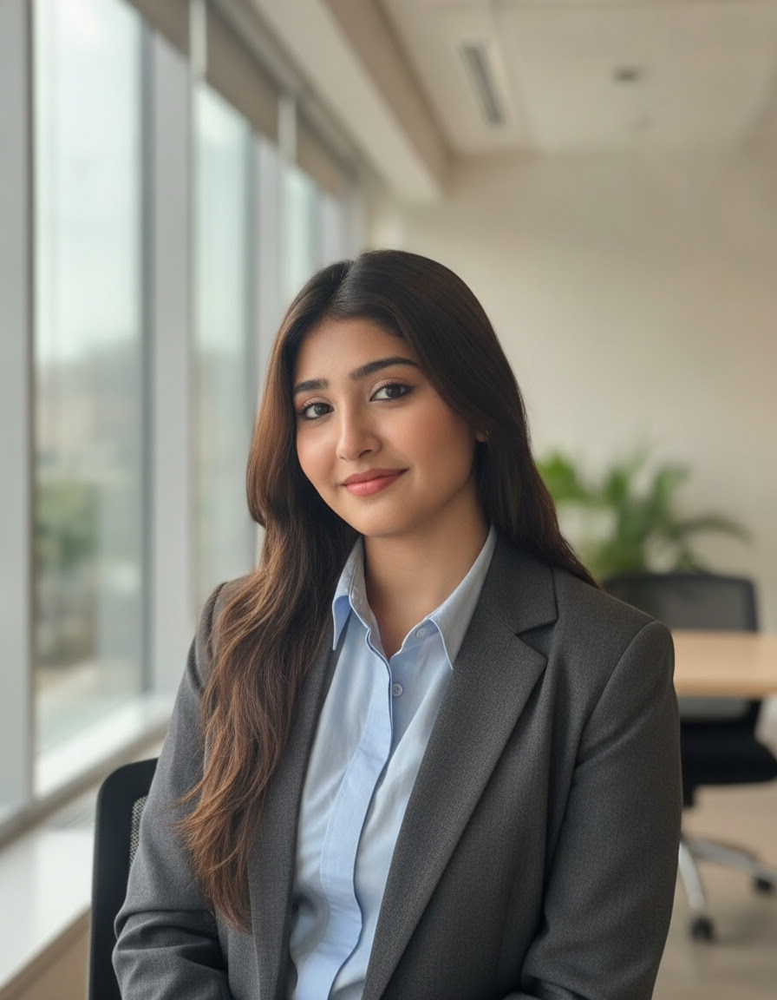
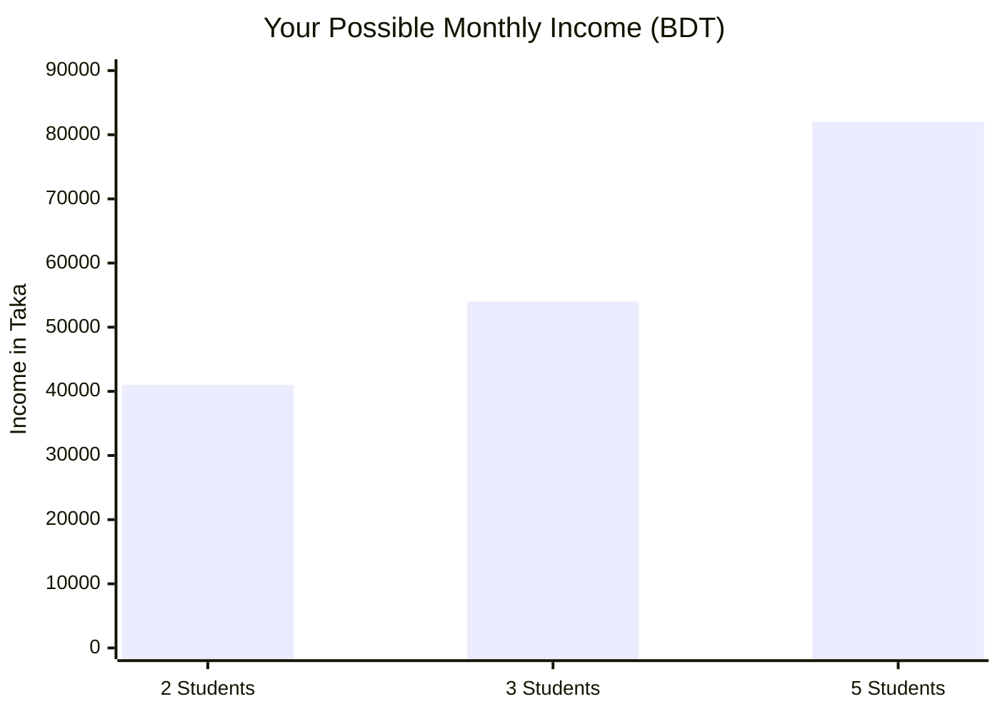
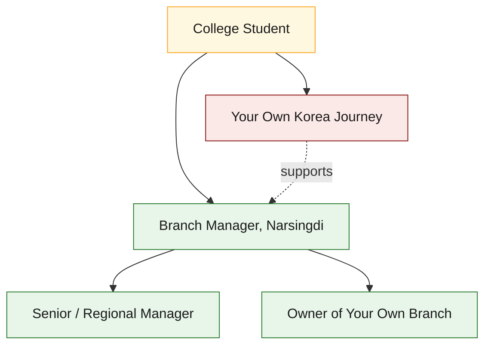
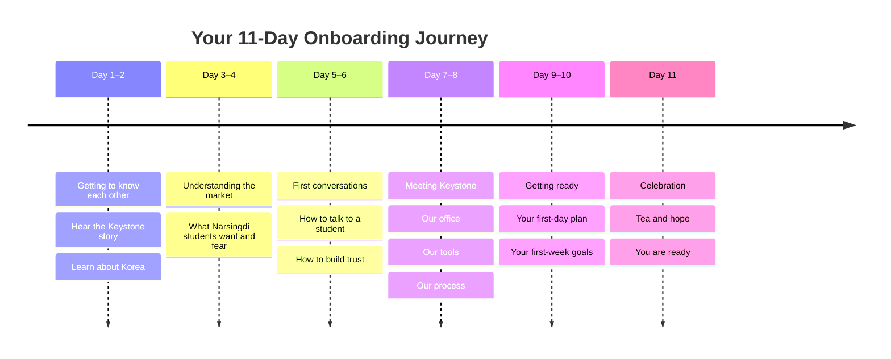

# Keystone Education Consultancy

<em>"Where global dreams begin"</em>

---

Marina Mou

Selected Branch Manager — Keystone Education, Narsingdi

**Date:** 18 July 2026 &nbsp;|&nbsp; **Joining Date:** 1 August 2026 
**Subject:** Your official invitation to become Branch Manager, Narsingdi

---

## Dear Marina,

Very soon, when people in Narsingdi hear the name "Keystone Education," one face will come to their mind first.

**That face will be yours.**

This letter is not just a normal job offer. It is bigger than that. It is an announcement: we have chosen you to be the first face of Keystone in Narsingdi.

Please read this letter slowly. Take your time. This is one of the biggest decisions of your life, and we want you to understand every part of it — why we chose you, what you will earn, what you will learn, and where this road can take you.

!!! success "In simple words"
    We want you to lead our new office in Narsingdi. You will help local students go abroad to study — mainly to South Korea. In return, you get a real salary, real commissions, real training, and a real career. Not just a job.

---

## Why You? Why Only You?

We received many applications from Narsingdi. We read every single one carefully. But one name kept coming back to the top of the list, again and again.

**Yours.**

Here is why:

-   :material-school:{ .lg .middle } **You Are Still a Student**

    ---

    You are currently studying at Narsingdi Government College. You understand how local students think, worry, and dream, because you are one of them. This is something no outsider can copy. It cannot be taught in a training session. It can only be lived.

-   :material-certificate:{ .lg .middle } **Your IELTS Score Is 6.5**

    ---

    This is not just a number on a piece of paper. It is proof. It proves that a girl from Narsingdi can reach an international standard. You are living proof that it can be done — and soon, hundreds of students will look at you and believe they can do it too.

-   :material-airplane-takeoff:{ .lg .middle } **You Are Applying to Korea Yourself**

    ---

    You are not learning this process from a textbook. You are living it, right now. You know the fear of waiting for a visa. You know the excitement of getting one step closer. When you talk to a worried student, you will not be guessing how they feel — you will already know.

-   :material-home-heart:{ .lg .middle } **You Are a Daughter of Narsingdi**

    ---

    Trust in a small town is not something you can buy with advertising. It has to be earned, slowly, over years. You already have it. Your family, your college, your neighbourhood — they already know and trust you.

You are not simply joining us as an employee. **You are becoming the face of Keystone in Narsingdi.** The way you speak, the way you explain things, the way you treat people — that is how all of Narsingdi will come to know and judge Keystone Education.

---

## Why Now? A Golden Opportunity in Narsingdi

Let's think simply about why so many young people in Bangladesh want to study abroad:

- The job market at home is shrinking. Every year, hundreds of thousands of students finish university, but there are not enough good jobs waiting for them.
- Studying abroad usually means working abroad too. And working abroad means more money coming back home to the family.
- In Korea, students can work part-time jobs while they study. This means many students can pay their own living costs.
- Korean tuition fees are often lower than private university fees in Bangladesh — sometimes only USD 2,000–5,000 per semester.
- Some Korean programs do not even require IELTS before you go. Students can learn English and Korean after they arrive.
- Every year, thousands of Bangladeshi students move to Korea, Malaysia, and Canada. And this number keeps growing, year after year.

Now think about Narsingdi.

```mermaid
flowchart LR
    A["Thousands of students in Narsingdi<br/>want to study abroad"] --> B["But there is no dedicated<br/>study-abroad office here"]
    B --> C["Every student is forced<br/>to travel to Dhaka"]
    C --> D["Extra travel cost + Dhaka agency fees<br/>= ৳3,00,000 or more"]
    D --> E["Keystone opens its<br/>first Narsingdi branch"]
    E --> F["Marina becomes the trusted,<br/>local, expert guide"]

    style A fill:#E8F5E9,stroke:#2E7D32,color:#1a1a1a
    style B fill:#FBE9E7,stroke:#8B1A1A,color:#1a1a1a
    style C fill:#FBE9E7,stroke:#8B1A1A,color:#1a1a1a
    style D fill:#FBE9E7,stroke:#8B1A1A,color:#1a1a1a
    style E fill:#E8F5E9,stroke:#2E7D32,color:#1a1a1a
    style F fill:#E8F5E9,stroke:#2E7D32,color:#1a1a1a
```

Narsingdi is still an **untouched goldmine.**

- There are **27 colleges** in Narsingdi Upazila alone. Thousands of students want to study abroad, but they simply do not know where to start.
- There is no dedicated study-abroad consultancy here. Every student who wants help has to travel all the way to Dhaka.
- What they need is one local, trustworthy person — someone who speaks their language and truly understands their fears.
- You already are that person to them. You are their college senior. They already know you, trust you, and will listen to you.
- One successful student usually brings ten new inquiries. In a small town like Narsingdi, word of mouth is the strongest kind of marketing there is.

Whoever fills this gap will become the name that Narsingdi thinks of first, whenever someone mentions studying abroad.

**That person is about to be you.**

---

## Your Income — Clear, Fair, and Real

We believe that good work deserves good rewards. Your income is built in three simple layers:

| Income Layer | What It Means | Amount |
|---|---|---|
| :material-cash: **Base Salary** | A guaranteed amount every month, for your first 2 months | **৳10,000–12,000/month** |
| :material-file-document: **Per Application** | Every time you submit a student's application | **৳1,000/application** |
| :material-passport: **Per Visa** | Every time a student's visa is confirmed, you get 10% of the service fee | **৳12,000/visa** (10% of ৳1,20,000) |

### Let's Calculate It Together

=== "If you help 2 students"

    | Income Source | Amount |
    |---|---|
    | Base salary | ৳12,000 |
    | Application fees (5 × ৳1,000) | ৳5,000 |
    | Visa commission (2 × ৳12,000) | ৳24,000 |
    | **Total monthly income** | **৳41,000** |

=== "If you help 3 students"

    | Income Source | Amount |
    |---|---|
    | Base salary | ৳12,000 |
    | Application fees (6 × ৳1,000) | ৳6,000 |
    | Visa commission (3 × ৳12,000) | ৳36,000 |
    | **Total monthly income** | **৳54,000** |

=== "If you help 5 students"

    | Income Source | Amount |
    |---|---|
    | Base salary | ৳12,000 |
    | Application fees | ৳10,000 |
    | Visa commission (5 × ৳12,000) | ৳60,000 |
    | **Total monthly income** | **৳82,000** |

Stop for a second. Read that last number again. ৳82,000 — every single month.

Now let's compare this to normal life in Bangladesh. A fresh university graduate usually earns around ৳15,000–20,000 a month, and often spends a full year just searching for that first job. A student who only finishes HSC and finds an entry-level job in Dhaka usually earns around ৳8,000–10,000 a month.

And you — still a college student, sitting right here in Narsingdi — are already calculating an income that could match, or even beat, an experienced corporate employee's salary in Dhaka.

!!! tip "This is only the beginning"
    The more skilled you become, the more students you will bring in, and the more you will earn. There is no ceiling on your income here. **The sky is the real limit.**

---

## A Day in the Life of Branch Manager Marina

Let's make this real. Imagine a normal Tuesday, a few months from now.

You open the small Keystone office in Narsingdi Bazar at 10:00 AM. A message is already waiting on WhatsApp from a student who wants to know about Korean universities. You reply with a smile — you know exactly what to say, because you have been trained for this.

At 11:30 AM, a student and his mother walk in. They are nervous. They have heard stories about agents who cheat people. You calm them down, explain the process step by step, and show them Keystone's real track record. By the time they leave, they trust you completely.

In the afternoon, you make a few calls to students who visited last week. You post something on the Keystone Facebook page about a Korean university's new intake. In the evening, you review two documents that need to go to Dhaka for final checking.

By 6:00 PM, you close the office. Nothing about the day felt like "hard labour." It felt like helping people, one conversation at a time — while building your own future, brick by brick.

This is the real, everyday shape of the opportunity in front of you.

---

## More Than a Salary — A Career

This is not just a job. It is a launchpad.

-   :material-book-open-page-variant:{ .lg .middle } **Free Training**

    ---

    You will learn everything: Korean visa steps, university applications, and documentation. In a short time, you will become a true expert in this field.

-   :material-earth:{ .lg .middle } **International Connections**

    ---

    You will work directly with Korean universities, agencies, and immigration officers. Your network will grow far beyond Bangladesh.

-   :material-briefcase:{ .lg .middle } **Real Business Skills**

    ---

    Sales, marketing, customer service, and document management — these skills will help you for your whole life, in any career you choose.

-   :material-office-building:{ .lg .middle } **Your Own Office**

    ---

    Your own office in Narsingdi Bazar. You are a Branch Manager, not just an employee.

-   :material-trending-up:{ .lg .middle } **Fast Growth**

    ---

    Do well for 2–3 months, and your salary grows. Do even better, and you could open your own new branch.

-   :material-account-tie:{ .lg .middle } **A Mentor Who Has Walked This Road**

    ---

    Our founder spent 9 years living in Korea. He will personally coach you, every single week.

-   :material-airplane:{ .lg .middle } **Your Own Dream Moves Forward Too**

    ---

    You are applying to Korea yourself. This job will make your own application process easier. You will learn and apply what you learn, at the same time.

!!! quote ""
    **From an ordinary college student to a Branch Manager — in just a few months.**
    This is not a fantasy. This is real, and it is standing right in front of you now.

---

## Who We Are — Keystone Education

-   :material-calendar-check: Founded in 2022 — **4+ years** of real experience
-   :material-map-marker: Offices in Gazipur (Head Office), Mymensingh, and now Narsingdi
-   :material-account-star: Our founder personally lived in Korea for **9 years**
-   :material-earth: We place students in Korea, Malaysia, Canada, the UK, and Europe
-   :material-web: Website: `www.keystoneeducations.com`
-   :material-facebook: An active Facebook page with thousands of followers
-   :material-whatsapp: Our own WhatsApp bot — talking to students 24/7
-   :material-handshake: A verified **ApplyBoard Recruitment Partner** — independently vetted, not a self-claim
-   :material-check-decagram: We recommend **only IEQAS-certified universities** — and we show families how to verify each one themselves on `studyinkorea.go.kr`

We are growing. And we want that growth to start from Narsingdi.

**You are the first step of that journey.**

<em>"Where global dreams begin"</em> — The Keystone Education motto

---

## Your 11-Day Journey to Getting Ready

Before your joining date (1 August), we will prepare you for success. This will not feel difficult — it will feel exciting. Every day, you will learn something new.

**You will never be left alone. We will be with you, every single step of the way.**

---

## Two Roads in Front of You

| Road 1: The Ordinary Path | Road 2: The Keystone Path |
|---|---|
| Finish college, then wait for a job | Start a real career right now |
| Apply with no real experience | Learn directly from experts |
| Stay limited to Narsingdi | Build international connections |
| Chase your dreams alone | Chase your dreams with a real team |
| Earn ৳0–5,000 a month | Earn **৳41,000+** a month, or more |
| An uncertain future | A clear, guided path of growth |

---

## Questions You Might Be Asking Yourself

??? question "What if I don't find students right away?"
    That is completely normal, especially in the first few weeks. Your base salary is guaranteed for the first 2 months so you have time to learn and build trust in the market. We will train you and support you closely during this time, so you are never simply left to figure it out alone.

??? question "Do I need experience to do this job?"
    No. You do not need past work experience. What you need is what you already have: honesty, a willingness to learn, and a real understanding of your own community. We will teach you everything else — step by step, during your 11-day onboarding and beyond.

??? question "What if this affects my own studies?"
    This role is designed to work alongside your college life, not against it. Many of your daily tasks — talking to students, posting updates, following up by phone — can fit around your class schedule. And because this work is directly related to your own Korea application, it often supports your studies instead of competing with them.

??? question "Is this a real, serious job — or just a side task?"
    It is a real, serious position, with a real title: Branch Manager. You will have your own office, your own responsibilities, and a real, documented income structure. Keystone has been operating since 2022, with real offices, real placements, and a real track record.

??? question "What happens if I do very well?"
    Then the road ahead gets even bigger. Strong performers can see their base salary increase, and — over time — may even get the opportunity to open and run their own branch elsewhere. Your growth is directly tied to your own results.

---

## Your Decision

Marina, the decision is yours. But let us say one thing clearly and honestly:

**We want you. Narsingdi needs you. And your own dream is calling you too.**

If you are ready, just say one word. We will begin your journey with you, starting today.

<a class="keystone-cta" href="mailto:munimm247@gmail.com?subject=Yes%2C%20I%20am%20ready%20-%20Marina">Yes, I Am Ready — Let's Begin</a>

---

With respect and warm wishes,

**Hasibul Munim**
Founder & CEO, Keystone Education Consultancy
:material-phone: +880 1941646278
:material-email: munimm247@gmail.com
:material-web: www.keystoneeducations.com

!!! quote ""
    **"Your dreams are bigger than the sky. We are only here to help you fly."**
    — Keystone Education
